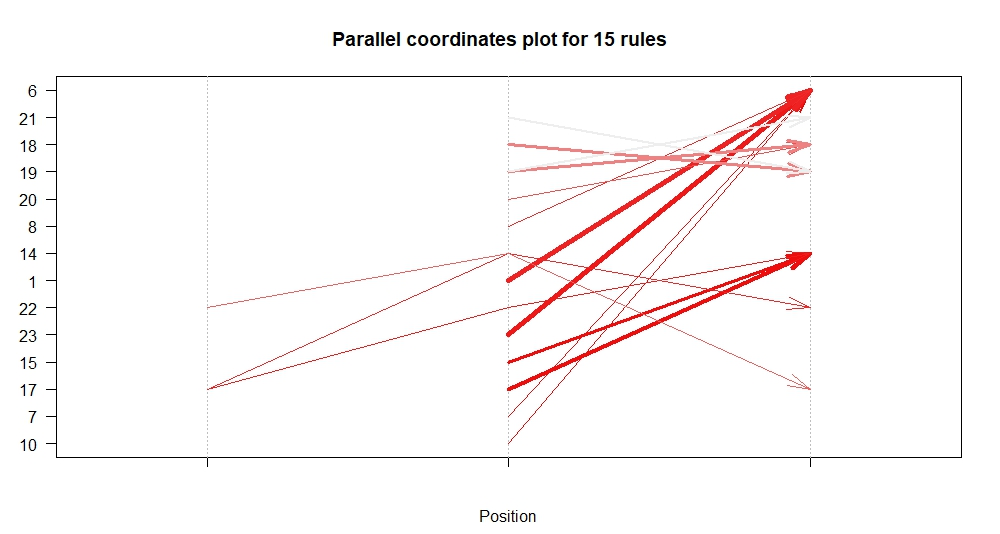
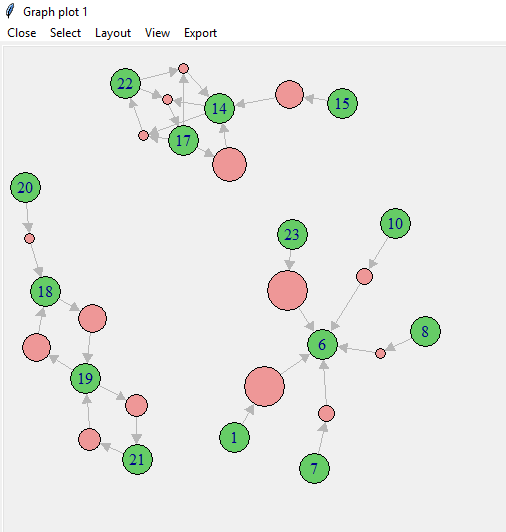
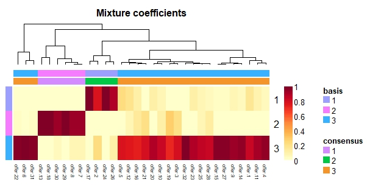
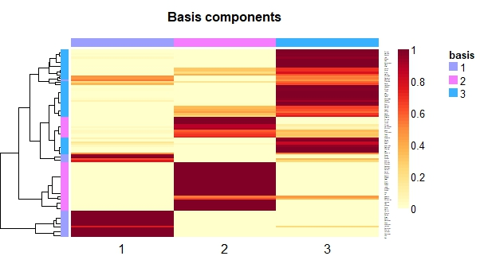
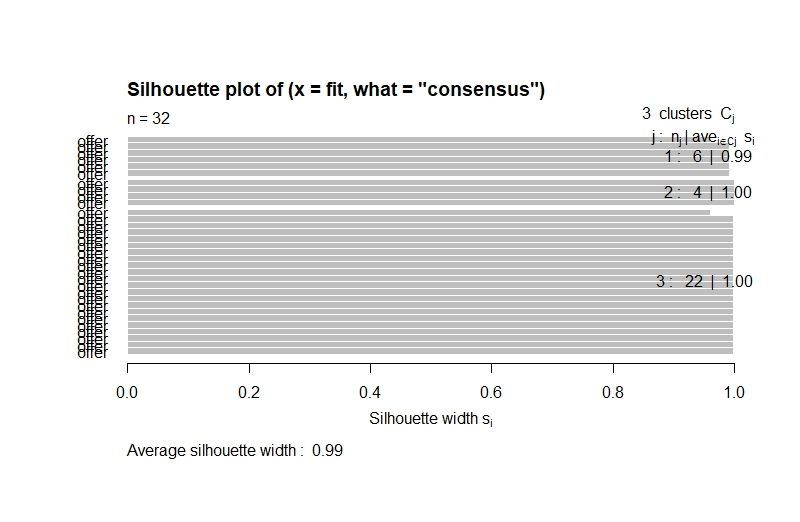
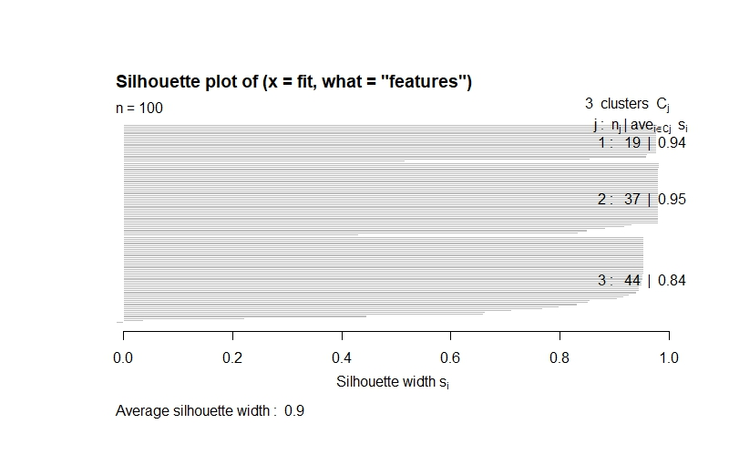

# Customer Analytics

*Market basket analysis and clustering on customer purchasing data*

Keywords: ***marketing target, customer segmentation, customer profiling, clustering, market basket analysis, apriori, nonnegative matrix factorization***

The dataset is from [Data Smart Chapter 2](https://www.wiley.com/en-us/Data+Smart%3A+Using+Data+Science+to+Transform+Information+into+Insight-p-9781118661468). Chapter 2 focuses on the New Jersey company Joey Bag O’ Donuts Wholesale Wine Emporium. The owner, Joey, travels the globe to find deals on wine and ships them back to Jersey where it is our job to sell it for a profit to retailers. Our main tool is the ever successful e-mail newsletter. Each month there is a new e-mail offering two or three deals. 

To improve the effectiveness of the marketing campaigns, we are going to create more target e-mail deals. Based on the transactions made by 100 customers in one year, we believe that we can offer them deals that we believe they will be interested in based on similar customers.

We are going to segment customers based on their buying preferences, and profile the segments to know the customers better which can help businesses to deliver enhanced customer service and boost customer satisfaction. Combining the market basket analysis, the business can target specific customer segments for promoting the specific offers and recommending products based on their their profiles and interests.

## Association rules
We integrate offers into products with different origins, there are 24 products offered in the marketing campaigns. 9 types of varietal from 9 origins were offered in 32 promotional campaigns.

| varietal.code | Varietal | Origin |
|--- | --- | --- |
| 1 | Cabernet Sauvignon | Italy |
| 2 | Cabernet Sauvignon | France |
| 3 | Cabernet Sauvignon | Oregon |
| 4 | Cabernet Sauvignon | Germany |
| 5 | Cabernet Sauvignon | New Zealand |
| 6 | Champagne | France |
| 7 | Champagne | New Zealand |
| 8 | Champagne | Germany |
| 9 | Champagne | California |
| 10 | Chardonnay | Chile |
| 11 | Chardonnay | South Africa |
| 12 | Espumante | Oregon |
| 13 | Espumante | South Africa |
| 14 | Malbec | France |
| 15 | Merlot | Chile |
| 16 | Merlot | California |
| 17 | Pinot Grigio | France |
| 18 | Pinot Noir | Australia |
| 19 | Pinot Noir | Italy |
| 20 | Pinot Noir | France |
| 21 | Pinot Noir | Germany |
| 22 | Prosecco | Australia |
| 23 | Prosecco | Chile |
| 24 | Prosecco | California |
> Table 1. Products offered in the marketing campaigns 

### Apriori rules

Let's highlight some interesting rules obtained from the market basket analysis. 

The first two rules show us that 7% customers bought Pinot Noir which are originated from Italy and Germany. The confidence indicate that how often the customer will buy item B if the he/she buy item A. We learnt that all the customers who bought Pinot Noir originated from Germany will buy the Italian Pinot Noir while only 58% of Italian Pinot Noir customers will buy the Pinot Noir originated from Germany. 

Another interesting findings we are going to discuss are rules 9 and 11. By inspecting the rules, we know that 10% of the customers purchased French Champangne and Italian Cabernet Sauvignon or Prosecco from Chile. 91% of Italian Cabernet Sauvignon lovers and 83% of customers who purchased Prosecco originated from Chile will also buy French Champangne.

To understand these rules easily, we can integrate these 15 rules into 3 groups as you can see in the plot above. This is a very simple recommender system which the company can recommend and design the combination of products to offer specific buyers and enthusiast. The business can increase their sales and improve the effectiveness of the offerings by leveraging this market basket analysis. 

#### Recommendation?
From the purchasing records, customer Gracia bought Italian Cabernet Sauvignon in June. From the findings above, we know that 91% of Italian Cabernet Sauvignon customers will also buy French Champangne, this shows us that Gracia may also interested in this product. So, our strategy is to send Gracia an offer of French Champangne on next promotional campaign of French Champangne.

## Customer Segmentation and Profiling

Due to high sparsity of the data, we perform the customer segmentation using matrix factorization. Non-negative matrix factorization(NMF) will be used to segment customers based on their buying preferences. Non-negative matrix factorization is a group of algorithms in multivariate analysis and linear algebra where the matrix is factorized into two simpler matrix, which are coefficient matrix and basis matrix. The coefficient matrix and basis matrix are combined to yield approximations of the observed data. 

NMF simplify the original matrix(customers in row, offers in columns, 1 means that the customer took respective offers) by reducing the number of columns from the 32 promotional campaigns to some smaller number of latent or hidden components. The coefficient matrix show us the relationship of latent components and the features in columns. The basis matrix is used to inspect the the relationship of latent components and customers, which provides us the customer segments we need.

### Coefficient matrix

As shown in the coefficient heatmap above, the offerings are assigned into 3 segments(groups/ clusters). Three segments are accounted for 12.5%, 18.75% and 68.75% respectively.

Segment 1: Offers 2, 17, 24, 26

Segment 2: Offers 7, 8 ,13, 18, 29, 30

Segment 3: Offers 1, 3, 4, 5, 6, 7, 9, 10, 11, 12, 14, 15, 16, 19, 20, 21, 22, 23,25, 27, 28, 31, 32

| | Segment 1 | Segment 2 | Segment 3 |
| --- | --- | --- | --- |
| No. of Origin | 4 | 5 | 9 |
| Types of Varietal | 1 | 5 | 7 |
| Mean of Minimum Quantity(kg) | 58.5 | 6 | 80.1 |
| Mean and standard deviation of discount rate(%) | 45.25(28) | 53.17(17.31) | 60.48(20.13) |
| Past Peak(%) | 0 | 17 | 30 |
> Table 2. Customer profiling based on the segmentation

From the findings above, all offerings of Pinot Noir are grouped into segment one, and only one type of varietal consisted in this segment. We can described second segment as small timers because the minimum purchasing quantity of this segment is only 6kg, much smaller than other two segments. Almost all types of the varietals from different origins included in the third segment and they have highest mean of minimum purchasing quantity. 68.75% of offerings are grouped into third segment, they can be concluded as variety and heavy drinkers.    

### Basis matrix

We end with the heatmap for the 100 customers. NMF yields what some consider to be a soft clustering with each respondent assigned a number that behaves like a probability (i.e., ranges from 0 to 1 and sums to 1). Each customer can be described as a profile of basis component scores. The underlying heterogeneity is revealed by this heatmap.

NMF decomposes the sparse bianry purchase data into 3 basis components, which are Pinot Noir lovers, small timers and variety and heavy drinkers. 19% of the customers clustered into segment 1(Basis #1 in the basis components heatmap), the customers in this segment are Pinot Noir lovers and they are single Pinot Noir drinkers. This can be seen by inspecting the bottom of the heatmap, those rows(customers) have only one column of dark red and yellow everywhere else.

They are followed by 37% small timers in the second component, most of them only get the offer with small quantity. The remaining rows of the heatmap show considerably more overlap because these customers' purchase profile cannot be reproduced using only one basis component. The customers in third segment are considered as variety and heavy drinkers, as they bought various type of varietal originated from origins and they usually buy in large quantity.

### Evaluation of NMF clustering
By definition from [wikipedia](https://en.wikipedia.org/wiki/Silhouette_(clustering)), silhouette refers to a method of interpretation and validation of consistency within clusters of data. The technique provides a succinct graphical representation of how well each object lies within its cluster. The silhouette value is a measure of how similar an object is to its own cluster (cohesion) compared to other clusters (separation). The silhouette ranges from −1 to +1, where a high value indicates that the object is well matched to its own cluster and poorly matched to neighboring clusters. The silhouette can be calculated with any distance metric, such as the Euclidean distance or the Manhattan distance. 

Euclidean distance is used in the evaluation of NMF clustering(customer segmentation).

As shown in the silhouette plots above, the clustering of offers has an average silhouette value of 0.99 while clustering of 100 customers has an average silhouette value of 0.9. Both silhouette value are very close to 1, we can conclude that the NMF clustering of offers and customers are appropriate.
