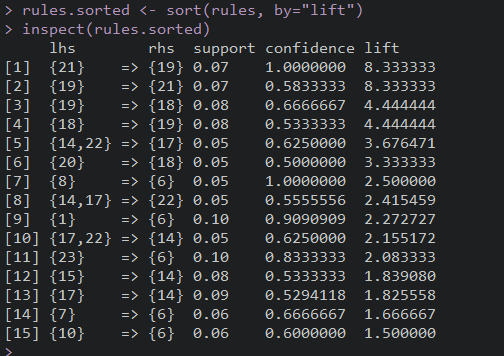

# Customer_analytics

*Market basket analysis and clustering on customer purchasing data*

Keywords: ***marketing target, customer segmentation, customer profiling, clustering, market basket analysis, apriori, nonnegative matrix factorization***

The dataset is from Data Smart Chapter 2. Chapter 2 focuses on the New Jersey company Joey Bag O’ Donuts Wholesale Wine Emporium. The owner, Joey, travels the globe to find deals on wine and ships them back to Jersey where it is our job to sell it for a profit to retailers. Our main tool is the ever successful e-mail newsletter. Each month there is a new e-mail offering two or three deals. 

To improve the effectiveness of the offerings, we are going to create more target e-mail deals. Based on the transactions made by 100 customers in one year, we believe that we can offer them deals that we believe they will be interested in based on similar customers.

We are going to segment customers based on their buying preferences, and profile the segments to know the customers better which can help businesses to deliver enhanced customer service and boost customer satisfaction. Combining the market basket analysis, the business can target specific customer segments for promoting the specific offers and recommending products based on their their profiles and interests.

## Association rules
We integrate offers into products with different origins, there are 24 products offered in the marketing campaigns. 9 types of varietal from 9 origins were offered in 32 promotional campaigns.

| varietal.code | Varietal | Origin |
|--- | --- | --- |
| 1 | Cabernet Sauvignon | Italy |
| 2 | Cabernet Sauvignon | France |
| 3 | Cabernet Sauvignon | Oregon |
| 4 | Cabernet Sauvignon | Germany |
| 5 | Cabernet Sauvignon | New Zealand |
| 6 | Champagne | France |
| 7 | Champagne | New Zealand |
| 8 | Champagne | Germany |
| 9 | Champagne | California |
| 10 | Chardonnay | Chile |
| 11 | Chardonnay | South Africa |
| 12 | Espumante | Oregon |
| 13 | Espumante | South Africa |
| 14 | Malbec | France |
| 15 | Merlot | Chile |
| 16 | Merlot | California |
| 17 | Pinot Grigio | France |
| 18 | Pinot Noir | Australia |
| 19 | Pinot Noir | Italy |
| 20 | Pinot Noir | France |
| 21 | Pinot Noir | Germany |
| 22 | Prosecco | Australia |
| 23 | Prosecco | Chile |
| 24 | Prosecco | California |
> Table 1. Products offered in the marketing campaigns 

### Apriori rules

Let's highlight some interesting rules from the market basket analysis. 

The first two rules show us that 7% customers bought Pinot Noir which are originated from Italy and Germany. The confidence indicate that how often the customer will buy item B if the he/she buy item A. We learnt that all the customers who bought Pinot Noir originated from Germany will buy the Italian Pinot Noir while only 58% of Italian Pinot Noir customers will buy the Pinot Noir originated from Germany. 

Another interesting findings we are going to discuss are rules 9 and 11. By inspecting the rules, we know that 10% of the customers purchased French Champangne and Italian Cabernet Sauvignon or Prosecco from Chile. 91% of Italian Cabernet Sauvignon customers and 83% of customers who purchased Prosecco originated from Chile will also buy French Champangne.

To understand these rules easily, we can integrate these 15 rules into 3 groups as you can see in the plot above. This is a very simple recommender system which the company can recommend and design the combination of products to offer specific buyers and enthusiast. The business can increase their sales and improve the effectiveness of the offerings by leveraging this market basket analysis. 

#### Recommendation?
From the purchasing records, customer Gracia bought Italian Cabernet Sauvignon in June. From the findings above, we know that 91% of Italian Cabernet Sauvignon customers will also buy French Champangne, this show us that Gracia may also interested in testing this product. So, our strategy is to send Gracia an offer of French Champangne in the next promotional campaign of French Champangne.

## Customer Segmentation and Profiling

matrix factorization
NMF - nonnegative matrix factorization

